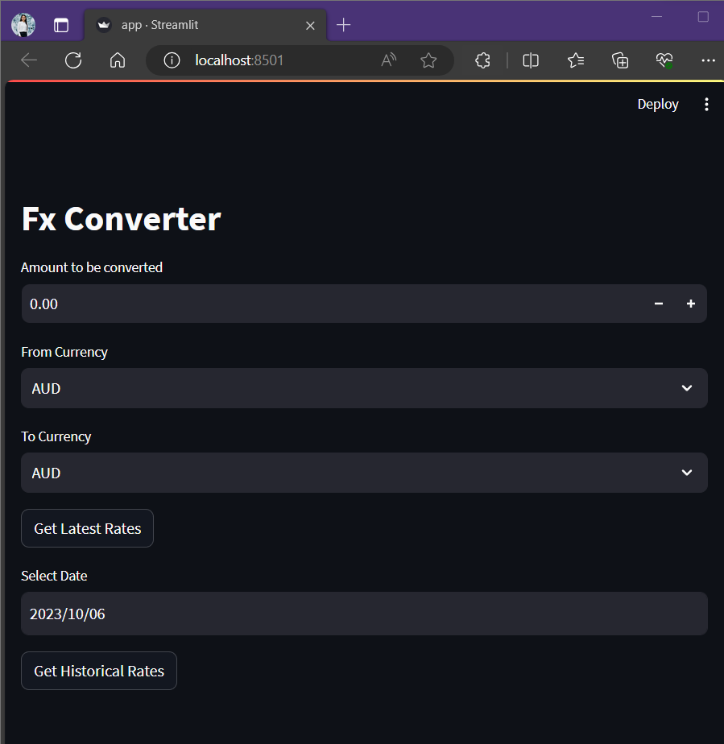

# <project title>

## Author
Name: Lihini Nisansala Dematan Pitiyage 

Student ID: 25024175

## Description
<What your application does>
The FX Converter application can perform currency conversion using data fetched from an open-source API: https://www.frankfurter.app/ 

The application has following key functionalities:
- Displays the current conversion rate between 2 currency codes for the alatest date. 
- Displays the historical conversion rate between 2 currency codes at a specific date.
- Calculate the inverse conversion rate between these 2 currencies.

<Some of the challenges you faced>

### Challenges Faced
- 
<Some of the features you hope to implement in the future>

### Future Implementations
- Develop a time series conversion data analysis feature using frankfurtur app's time series endpoint.
- Develop a currency rate prediction feature.

## How to Setup
<Provide a step-by-step description of how to get the development environment set and running.>
<Which Python version you used>
<Which packages and version you used>

## How to Run the Program
<Provide instructions and examples>

## Project Structure
<List all folders and files of this project and provide quick description for each of them>

**app.py:**

**api.py:**

**frankfurter.py:**

**currency.py:**

**README.md:**

## Citations
<Mention authors and provide links code you source externally>
